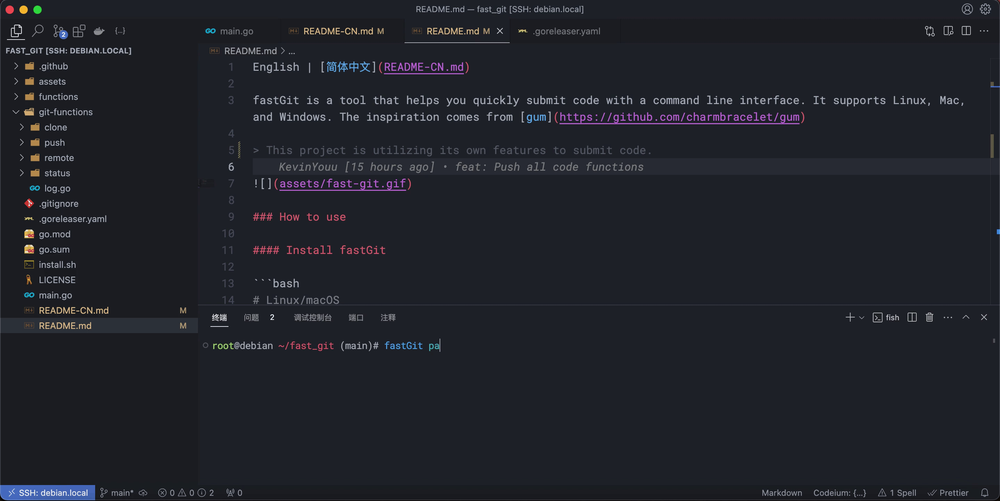

[English](README.md) | 简体中文

fastGit 是一个帮助你快速提交代码的命令行工具,支持 Linux、MacOS、Windows。灵感来自 [gum](https://github.com/charmbracelet/gum)

> 项目本身正在使用它来提交代码

> 

### 感谢以下开源项目

[go](https://github.com/golang/go)

[go-git](https://github.com/go-git/go-git)

[bubbletea](github.com/charmbracelet/bubbletea)
